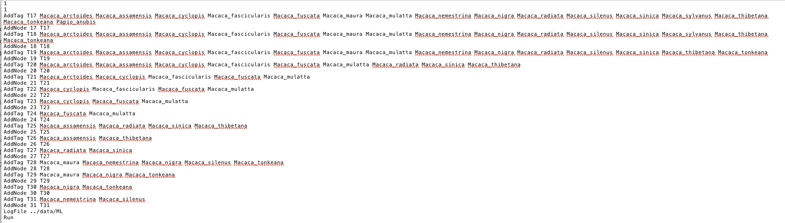

```{r, setup, include=FALSE}
knitr::opts_chunk$set(
  message=FALSE, warning=FALSE, fig.align='center'
)
```

## Outline

This document provides an example of how to do ancestral state reconstruction using BayesTraits. It uses the dataset and some of the advice on fitting the MCMC model provided [here](https://wiki.duke.edu/display/AnthroTree/3.6+Bayesian+Reconstructions+for+Discrete+Characters+in+BayesTraits). BayesTraits can be used for many different analyses, this tutorial is specifically designed to demonstrate how BayesTraits can be used to reconstruct all the nodes in a phylogenetic tree.
 
## Installation of BayesTraits

BayesTraits is a computer package - written by Mark Pagel and others - for performing analyses of trait evolution among groups of species for which a phylogeny or sample of phylogenies is available. BayesTraits for several operating systems can be downloaded [here](http://www.evolution.reading.ac.uk/BayesTraitsV4.0.0/BayesTraitsV4.0.0.html). In this R project I have placed the BayesTraits download folder in the base folder of the proect.

We can check that BayesTraits has been downloaded and is useable. I added a random word as otherwise BayesTraits is interactive and does not work in the code chunk!

```{bash, eval = FALSE}
../BayesTraitsV4.0.0-OSX/BayesTraitsV4 Help
```

```
BayesTraits V4.0 (Feb 21 2022)
Mark Pagel and Andrew Meade
www.evolution.reading.ac.uk


Could not open file control for reading
```

## Load in R packages

First we will load in the R packages used in the analysis.

```{r load_packages}
# load packages
library(here)
library(posterior)
library(tidybayes)
library(coda)
library(btw) # remotes::install_github('rgriff23/btw')
library(tidytree)
library(ape)
library(tidyverse)
library(patchwork)
```

## Look at the example data

We can have a quick look at the example data to see how it is organised. The data is of evidence of exaggerated sexual swellings in primates (Nunn 1999). We can load in the tree and trait data and plot the tree easy enough.

We will check that the tip labels are in the same order as the trait values too.

```{r load_data, fig.height=5, fig.width=7}
# set where I am in the project
here::i_am('scripts/BayesTraits.Rmd')

# load in tree
tree <- read.nexus(here('data/anthrotree36_tree.nex'))
tree

plot(tree)

# read in trait data
trait <- read.table(here('data/anthrotree36_data.txt'))

# is the tree tip order the same as the V1 order
sum(tree$tip.label == trait$V1) == nrow(trait)
# YES
```

It all looks good. 

## Create control file to reconstruct all internal nodes of a tree

BayesTraits is commonly ran interactively, but you can pass a control file to it which contains the parameters for the run. We will use this approach when reconstructing ancestral nodes.

From the BayesTraits [manual](http://www.evolution.reading.ac.uk/BayesTraitsV4.0.0/Files/BayesTraitsV4.0.0-Manual.pdf) it shows how one of these control files can be created to reconstruct a specific node.

```
1
2
AddTag TRecNode Porpoise Dolphin FKWhale Whale
AddNode RecNode TRecNode
Run
```

The commands we are interested in are `AddTag` and `AddNode`. `AddTag` creates a tag called **TRecNode** defined by four extant taxa Porpoise, Dolphin, FKWhale and Whale. The `AddNode` command is used to reconstruct the tag - which is called **RecNode** in this instance, so the node can be identified in the output.

So to reconstruct any given node we need to give it a name - e.g. the node number - and the offspring tip labels from that node.

We can create this relatively easily using the R package [tidytree](https://yulab-smu.top/treedata-book/) and its function **offspring()**.
 
```{r tidytree}
# for each internal node, get the labels of the offsping nodes

# convert tree to a dataframe
tree_data <- as_tibble(tree)
# internal nodes do not have a label in this example

# create a dataframe which has each internal node
# create an empty column for tip labels
d_nodes <- tibble(nodes = dplyr::filter(tree_data, is.na(label)) %>% pull(node),
                  label = NA)

# run for loop to calculate tip labels for each node
for(i in 1:nrow(d_nodes)){
  temp_node = d_nodes$nodes[i]
  temp_offspring <- offspring(tree_data, temp_node, tiponly = TRUE)
  d_nodes$label[i] <- temp_offspring$label %>% paste0(collapse = ' ')
  }

# add in the correct commands needed to reconstruct the ancestral states
d_nodes <- mutate(d_nodes, first_command = paste('AddTag', paste('T', nodes, sep = ''), label, sep = ' '),
                  second_command = paste('AddNode', nodes, paste('T', nodes, sep = ''), sep = ' '))

# output this as a vector
to_save <- select(d_nodes, first_command, second_command) %>%
  pivot_longer(everything(), names_to = 'blah', values_to = 'command') %>%
  pull(command)

# we can then save this out
write.table(to_save, here('data/anthrotree_tag_nodes.txt'), quote=FALSE, col.names = FALSE, row.names = FALSE)

head(to_save)

```
We then copied this block into control files that can be passed to BayesTraits. We created control files for both running BayesTraits in maximum likelihood mode and in MCMC mode. See the scripts folder for examples. An example is below.


You can see that each node has a unique combination of tip labels assigned to it.

## Run BayesTraits in ML mode

We can now try and run BayesTraits in Maximum Likelihood mode.

```{bash run_bayestraits, results='hide', eval=FALSE}
../BayesTraitsV4.0.0-OSX/BayesTraitsV4 ../data/anthrotree36_tree.nex ../data/anthrotree36_data.txt < ../scripts/max_likelihood_control.txt
```

Wow that was fast!

Lets try and read in the data from the output file. We can use the R package **btw** to do this. We can then do some post processing to turn the ancestral state probabilities into long format.

```{r bayestraits_ml_output}
# read in output from BayesTraits
output <- parse_log(here('data/ML.Log.txt'))

# grab just the nodes and transform
d_output <- select(output$results, starts_with('X')) %>%
  pivot_longer(everything(), names_to = 'var', values_to = 'prob') %>%
  filter(!is.na(prob)) %>%
  separate(col = var, c('node', 'p', 'state'), sep = '\\.') %>%
  select(-p) %>%
  mutate(node = gsub('X', '', node))

head(d_output)

```
Now for each internal node we have the probability that the state is either 0 or 1 from the BayesTrait ML model. What is really nice useing this approach is that we can run the same analysis using **ape::ace()** and easily compare the results for each node as we have used the same names in our BayesTraits control file.

So we can estimate ancestral states using the all rates different model (ARD) in **ace::ape()**

```{r ape}
# with ape
ancestral_states_ape <- ace(trait$V2, tree, model="ARD", type="discrete")

# get marginal likelihood of each ancestral state at each node
# turn ancestral state likelihoods into a data.frame
d_acr_ape <- ancestral_states_ape$lik.anc %>%
  data.frame()

# add nodes in as row names
row.names(d_acr_ape) <- row.names(ancestral_states_ape$lik.anc)

# do some data processing
d_acr_ape <- rownames_to_column(d_acr_ape, var = 'node') %>%
  pivot_longer(cols = c(X0, X1), values_to = 'probability_ape', names_to = 'state') %>%
  mutate(state = gsub('X', '', state))


```

We can compare these approaches easily

```{r compare, fig.height=5, fig.width=7}
# bind datasets together
d_compare <- left_join(d_output, d_acr_ape)

# plot
ggplot(d_compare, aes(prob, probability_ape)) +
  geom_abline(aes(intercept = 0, slope = 1), col = 'red') +
  geom_smooth(method = 'lm', se = FALSE, col = 'dark grey') +
  geom_point() +
  theme_bw() +
  labs(x = 'probability from BayesTraits',
       y = 'probability from ape::ace')

```

We can see that there is quite good congruence between the two approaches.

## Run BayesTraits in MCMC mode

We can try and run the same analysis but using MCMC instead of ML. To be able to check convergence we need to run multiple chains of the same run and then combine these results together. 

For the control files, we set a uniform prior for all of `uniform 0 0.3` given the rates of transition between 0 -> 1 and 1 -> 0 from the maximum likelihood approach. These were `r d_output$results$q01` and `r d_output$results$q10` respectively, so we used much more constrained priors than the default `uniform 0 100`. There are lots of other parameters that can be tinkered with to help convergence and they can all be found in the BayesTraits [manual](http://www.evolution.reading.ac.uk/BayesTraitsV4.0.0/Files/BayesTraitsV4.0.0-Manual.pdf)

We will run multiple runs of the MCMC analysis and then combine runs.

```{bash run_bayestraits_mcmc, results='hide', eval=FALSE}
../BayesTraitsV4.0.0-OSX/BayesTraitsV4 ../data/anthrotree36_tree.nex ../data/anthrotree36_data.txt < ../scripts/MCMC_control1.txt
../BayesTraitsV4.0.0-OSX/BayesTraitsV4 ../data/anthrotree36_tree.nex ../data/anthrotree36_data.txt < ../scripts/MCMC_control2.txt
../BayesTraitsV4.0.0-OSX/BayesTraitsV4 ../data/anthrotree36_tree.nex ../data/anthrotree36_data.txt < ../scripts/MCMC_control3.txt
```

## Check convergence of BayesTraits in MCMC mode

We can again use functions from [btw](https://github.com/rgriff23/btw) to parse in the results. Specifically we will see whether the results have converged using functions from the R package **coda**.

```{r parse_mcmc}
# read in output
# following information from here: https://github.com/simjoly/CourseComparativeMethods/blob/master/lecture4/BayesTraits.Rmd
d_mcmc1 <- parse_log(here('data/mcmc1.Log.txt'))
d_mcmc2 <- parse_log(here('data/mcmc2.Log.txt'))
d_mcmc3 <- parse_log(here('data/mcmc3.Log.txt'))

# grab sampling period - thin argument in coda::mcmc() from the files
mcmc1_sampling <- parse_number(d_mcmc1$options[which(str_detect(d_mcmc1$options, 'Sample Period'), TRUE)])
mcmc2_sampling <- parse_number(d_mcmc2$options[which(str_detect(d_mcmc2$options, 'Sample Period'), TRUE)])
mcmc3_sampling <- parse_number(d_mcmc3$options[which(str_detect(d_mcmc3$options, 'Sample Period'), TRUE)])

# create mcmc objects for compatibility with coda
mcmc1 <- as_draws_matrix(d_mcmc1$results)

mcmc1 <- d_mcmc1$results %>%
  janitor::clean_names() %>%
  select(., -tree_no, -iteration) %>%
  mcmc(start = min(d_mcmc1$results$Iteration), end = max(d_mcmc1$results$Iteration), thin = mcmc1_sampling)
mcmc2 <- d_mcmc2$results %>%
  janitor::clean_names() %>%
  select(., -tree_no, -iteration) %>%
  mcmc(start = min(d_mcmc2$results$Iteration), end = max(d_mcmc2$results$Iteration), thin = mcmc2_sampling)
mcmc3 <- d_mcmc3$results %>%
  janitor::clean_names() %>%
  select(., -tree_no, -iteration) %>%
  mcmc(start = min(d_mcmc3$results$Iteration), end = max(d_mcmc3$results$Iteration), thin = mcmc3_sampling)

# combine chains
res_mcmc <- mcmc.list(mcmc1, mcmc2, mcmc3)

```

We can look at the trace plots of some of the variables.

```{r trace_plot, fig.height = 5, fig.width=10}
par(mfrow = c(1,3))
traceplot(res_mcmc[,c('lh', 'q01', 'q10')])
```

We can calculate convergence diagnostics such as the effective sample size (should all be >200) and gelman diagnostic (should all be ~1).

```{r convergence_diagnostics}
# calculate effective sample sizes - should all be > 200
d_ess <- effectiveSize(res_mcmc)
summary(d_ess)

# calculate gelman diagnostic - should all be really close to 1
d_gelman <- gelman.diag(res_mcmc, autoburnin = FALSE, multivariate = FALSE)
summary(d_gelman$psrf)
```

## Visualise ancestral state reconstructions

We can grab the draws out of the **coda** object using **tidybayes** and plot the density plots of our ancestral state reconstructions for each node.

So everything has converged apparently, but we can look at how our MCMC process compares to the **ace::ape()** approach and the maximum likelihood approach of BayesTraits.
 
```{r tidybayes, fig.height=8, fig.width=10}
# grab draws
d_mcmc <- tidy_draws(res_mcmc) %>%
  select(., -lh, -q01, -q10, -root_p_0, -root_p_1) %>%
  pivot_longer(starts_with('x'), names_to = 'var', values_to = 'prob') %>%
  filter(!is.na(prob)) %>%
  separate(col = var, c('node', 'p', 'state'), sep = '_') %>%
  select(-p) %>%
  mutate(node = gsub('x', '', node))

# plot the distributions for each chain
ggplot(d_mcmc, aes(prob)) +
  geom_line(aes(col = state, group = interaction(.chain, state)), stat = 'density') +
  facet_wrap(~node, scales = 'free') +
  theme_bw() +
  scale_color_manual(values = c('black', 'blue'))
```

From this we can see that the chains are returning the same results, but for many of the nodes the model gets stuck at estimated the node to be 50/50 for the trait state.

We can compare these results to the results from the ML methods used earlier by calculating median credible intervals.

```{r comparison_mcmc_ml, fig.height = 5, fig.width = 12}
# calculate median credible intervals for the MCMC approach
d_mcmc_summary <- group_by(d_mcmc, node, state) %>%
  median_qi()

# combine these to our comparison dataset
d_compare <- left_join(rename(d_compare, prob_ml = prob), d_mcmc_summary)

# make first plot ape::ace vs MCMC
p1 <- ggplot(d_compare, aes(prob, probability_ape)) +
  geom_abline(aes(intercept = 0, slope = 1), col = 'red') +
  geom_point() +
  geom_linerange(aes(y = probability_ape, xmin = .lower, xmax = .upper)) +
  geom_smooth(method = 'lm', se = FALSE, col = 'dark grey') +
  theme_bw() +
  labs(x = 'probability from BayesTraits MCMC',
       y = 'probability from ape::ace')

# make second plot ML vs MCMC
p2 <- ggplot(d_compare, aes(prob, prob_ml)) +
  geom_abline(aes(intercept = 0, slope = 1), col = 'red') +
  geom_point() +
  geom_linerange(aes(y = prob_ml, xmin = .lower, xmax = .upper)) +
  geom_smooth(method = 'lm', se = FALSE, col = 'dark grey') +
  theme_bw() +
  labs(x = 'probability from BayesTraits MCMC',
       y = 'probability from BayesTraits ML')

p1 + p2

```

We can see there is a lot of uncertainty around the trait states using the MCMC approach. This could be potentially helped by (a) restricting the transition matrix and doing model selection to see if it improves the model fit and (b) altering the priors further, but other tutorials exist that give guidance on this. For example, [here](https://wiki.duke.edu/display/AnthroTree/3.6+Bayesian+Reconstructions+for+Discrete+Characters+in+BayesTraits), [here](https://isu-molphyl.github.io/EEOB563/computer_labs/lab8/BayesTraits.html) and [here](https://github.com/simjoly/CourseComparativeMethods/blob/master/lecture4/BayesTraits.pdf).

This tutorial has instead concentrated on demonstrating a relatively easy way to specify BayesTraits to reconstruct all internal nodes in a given phylogenetic tree.

**References**

- Pagel, M., A. Meade, and D. Barker. 2004. Bayesian estimation of ancestral character states on phylogenies. Systematic Biology 53:673-684.
- Pagel, M., and A. Meade. 2006. Bayesian analysis of correlated evolution of discrete characters by reversible-jump Markov chain Monte Carlo. American Naturalist 167:808-825.
- Nunn, C. L. 1999. The evolution of exaggerated sexual swellings in primates and the graded signal hypothesis. Animal Behaviour 58:229-246.